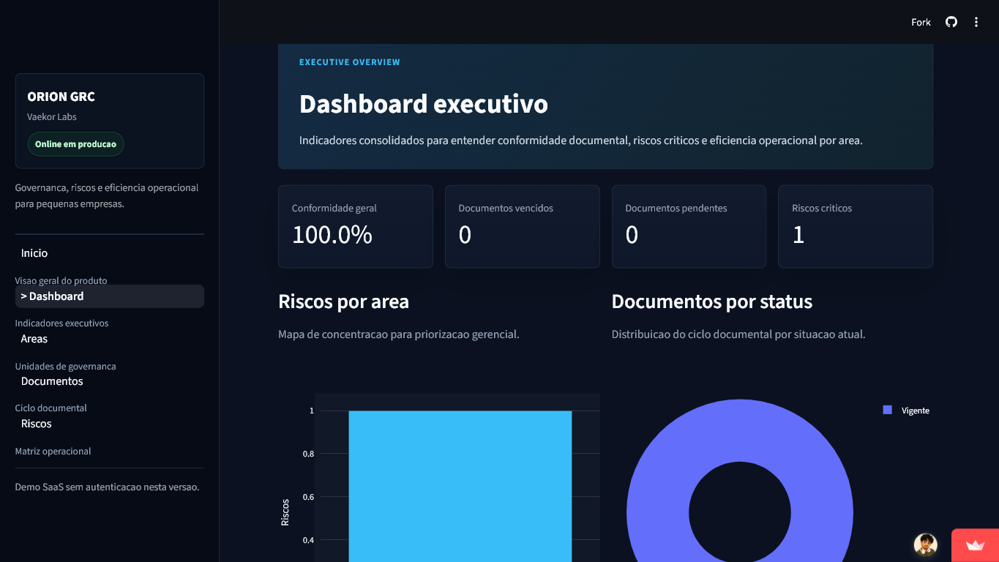
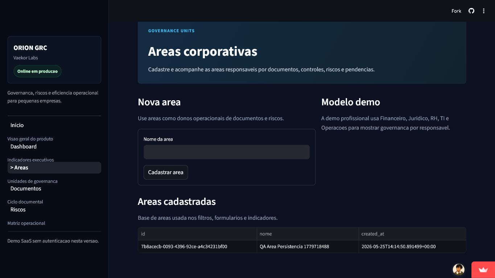
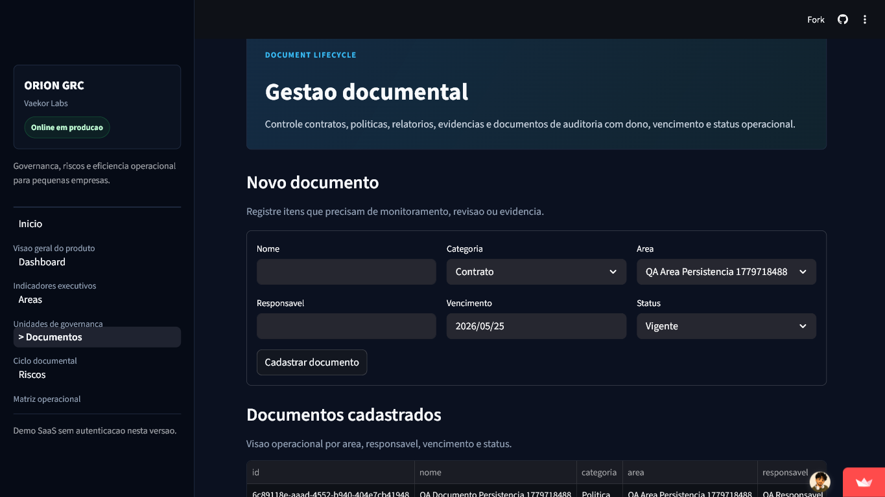
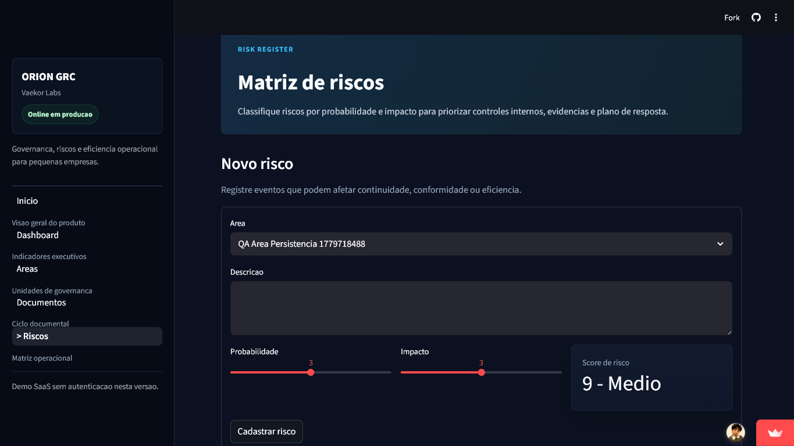

# ORION GRC

ORION GRC is a Governance, Risk & Compliance workspace for corporate teams that need executive visibility over documents, obligations, risks and operational efficiency.

Developed by Vaekor Labs.

---

## Live Demo

[https://orion-grc.streamlit.app/](https://orion-grc.streamlit.app/)

---

## Status

Corporate product demo deployed online for portfolio and functional validation.

Current scope:

- Public demo without authentication
- No role-based access control yet
- No AI features yet
- Supabase/PostgreSQL persistence
- Corporate demo seed available through a local administrative loader

---

## Product Vision

ORION GRC helps organizations consolidate governance routines into one executive workspace.

The product is designed to help teams:

- Centralize contracts, policies, procedures, audit files and monitoring evidence
- Track document expiration, pending reviews and corporate obligations
- Monitor operational, contractual, financial, compliance and information security risks
- Visualize efficiency by Finance, Legal, Compliance, Human Resources, IT, Operations, Procurement and Internal Audit
- Support executive governance routines, audit preparation and risk-based follow-up

---

## Problem Solved

Governance teams often manage controls, documents, risks and evidence through disconnected spreadsheets, folders and informal follow-ups. This makes it hard to know which documents are expired, which risks need attention and which areas are operating outside the expected control flow.

ORION GRC turns this into a single dashboard with documents, areas, risks and operational KPIs.

---

## Screenshots

### Dashboard



### Areas



### Documentos



### Riscos



---

## Features

- Executive Cockpit for governance, risk and compliance
- Executive summary generated by local business rules
- Executive Intelligence Engine with deterministic insights, priorities and positive highlights
- Compliance score and risk posture panels
- Strategic alerts for expired documents, pending items, critical risks and uncovered areas
- General conformity KPI
- Expired and pending document monitoring
- Risk scoring by probability and impact
- Risk classification: Low, Medium, High and Critical
- Area-based tracking
- Areas Intelligence with operational metrics, rankings and automated insights
- Document lifecycle management
- Documents Intelligence with compliance metrics, priorities and automated insights
- Operational efficiency by area
- Executive semantic chart colors for document health, risk concentration and performance bands
- Plotly analytics dashboards
- Supabase cloud persistence
- Corporate demo dataset with realistic documents, risks and evidence
- Future-ready database structure for profiles, users, evidence and audit history

---

## Modules

### Dashboard / Executive Cockpit

- Executive summary
- Executive Intelligence
- Executive Priorities
- Organizational assessment generated from current dashboard data
- Positive performance highlights
- Compliance score
- Risk posture
- Strategic alerts
- General conformity
- Expired documents
- Pending documents
- Critical risks
- Risks by area
- Documents by status
- Operational efficiency by area

### Areas

- Area registration
- Operational cards with documents, pending items, expired items, risks, critical risks and efficiency
- Operational ranking and automated Area Intelligence
- Positive highlights by area
- Operational area listing without technical UUID columns
- Foundation for area ownership and future access rules

### Documents

- Document registration
- Executive document indicators and conformity rate
- Automated Document Intelligence by area and owner
- Document priorities for expired, pending and near-expiration items
- Positive document highlights
- Operational document listing without technical UUID columns
- Category, owner, expiration date and status
- Support for contracts, policies, procedures, reports, flowcharts, KPIs and audit files

### Risks

- Risk registration
- Automatic score calculation
- Impact and probability sliders
- Operational prioritization by classification

---

## Demo Data

Professional demo data is available in:

```text
database/seed_demo.sql
```

It can be loaded locally with:

```bash
python scripts/load_demo_data.py
```

The seed includes a fictional medium-sized organization with 8 areas:

- Financeiro
- Juridico
- Compliance
- Recursos Humanos
- Tecnologia da Informacao
- Operacoes
- Compras
- Auditoria Interna

It includes 27 realistic documents across corporate categories such as policy, contract, procedure, report, evidence and audit. The document status distribution is designed to produce a meaningful Executive Cockpit:

- 19 Vigente
- 5 Pendente
- 3 Vencido

It also includes 20 risks distributed across multiple areas and severity levels:

- 4 Baixo
- 8 Medio
- 5 Alto
- 3 Critico

The dataset creates a credible executive narrative with active critical risks, pending documents, expired documents, efficiency variation by area and richer charts for operational analysis. It also includes evidence records linked to selected documents and risks for future audit workflows.

The loader is intentionally administrative and is not executed automatically by the app. It reads `database/seed_demo.sql`, applies the demo records with `SUPABASE_SERVICE_ROLE_KEY`, and prints validation totals for areas, documents and risks. The operation is idempotent for the demo records and does not require changes to the application key.

---

## Stack

- Streamlit
- Supabase/PostgreSQL
- Pandas
- Plotly

---

## Setup

1. Create a virtual environment:

```bash
python -m venv .venv
```

2. Activate the environment and install dependencies:

```bash
pip install -r requirements.txt
```

3. Copy the environment example:

```bash
cp .env.example .env
```

4. Fill `.env` with the Supabase project URL and anon public key:

```env
SUPABASE_URL=
SUPABASE_KEY=
# Optional: only for local administrative scripts
SUPABASE_SERVICE_ROLE_KEY=
```

Use the Supabase `anon public` key only.

Do not use `service_role` in the app. `SUPABASE_SERVICE_ROLE_KEY` is only used by `scripts/load_demo_data.py` to load the corporate demo data locally.

On Streamlit Cloud, configure the same values in `st.secrets`:

```toml
SUPABASE_URL = "your-project-url"
SUPABASE_KEY = "your-anon-public-key"
```

5. Execute the database schema in Supabase SQL Editor:

```text
database/schema.sql
```

6. Optionally load the corporate demo seed:

Add `SUPABASE_SERVICE_ROLE_KEY` to your local `.env`, then run:

```bash
python scripts/load_demo_data.py
```

The script exits before loading data if `SUPABASE_SERVICE_ROLE_KEY` is not configured.

It reads:

```text
database/seed_demo.sql
```

7. Run locally:

```bash
streamlit run app.py
```

For Streamlit Community Cloud:

- Repository: `ypernambuco/orion-grc`
- Branch: `main`
- Main file path: `app.py`

Never commit `.env`, credentials or Supabase secrets.

---

## Security Notes

- `.env` must remain ignored by Git
- Supabase credentials must be stored locally or in `st.secrets`
- The app rejects `service_role` keys
- Authentication is intentionally not implemented in this version
- Role-based access control is intentionally not implemented in this version

---

## Future Access Architecture

This version does not implement login, but the database already prepares the foundation for future access control by profile and area.

Planned profiles:

- admin: full access
- governanca: all areas, documents and risks
- juridico: legal documents and legal risks
- gestor_area: own area only
- diretoria: dashboards and general KPIs
- auditoria: documents, evidence and history

The schema includes future-ready tables for:

- perfis
- usuarios
- evidencias
- historico_eventos

The optional `auth_user_id` column in `usuarios` can be connected to `auth.users.id` when authentication is implemented.

---

## Risk Classification

- 1 to 4: Baixo
- 5 to 9: Medio
- 10 to 15: Alto
- 16 to 25: Critico

---

## Roadmap

- [x] Initial project structure
- [x] Supabase integration
- [x] Professional enterprise-style presentation
- [x] Executive Cockpit
- [x] Executive Intelligence Engine
- [x] Areas Intelligence
- [x] Area management
- [x] Document management
- [x] Documents Intelligence
- [x] Risk management
- [x] Manual corporate demo seed
- [x] Production demo on Streamlit Cloud
- [ ] Authentication
- [ ] Role-based access control
- [ ] Multi-company workspace
- [ ] Evidence upload
- [ ] Advanced audit trail
- [ ] Automated alerts
- [ ] Operational AI assistant
- [ ] Operational graph visualization

---

## License

MIT License
